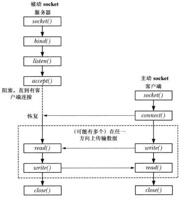

&emsp;&emsp;允许在同一个主机或通过一个网络连接起来的不同主机上的应用程序之间的通信

### socket domain


### socket类型
socket的类型有两种，流（socket stream）和数据报（socket dgram）；流使用了传输控制协议TCP，数据报使用了用户数据报协议UDP，两者socket的区别如下：

| 属性 | 流 | 数据报 |
| :--- | :---: | :---: |
| 是否可靠 | 是 | 否 |
| 是否面向连接（双向的，一个socket连接到另一个socket）| 是 | 否 |
| 是否保留消息边界（字节流） | 否 | 是 | 

### socket_stream流程
- socket; 服务端或客户端创建一个socket
- bind; 将socket绑定到一个位置上，客户端需要定位到这个位置才能知道这个socket    
- listen; 服务端监听来自客户端的连接
- accept; 服务端接受来之客户端的连接,在connect之前是阻塞的
- connect; 客户端建立连接到服务端  
  
socket I/O通过write和read或send或recv来完成，默认是阻塞的，可以通过fcntl()的F_SETFL操作来启用O_NONBLOCK来执行非阻塞IO

#### 创建socket
```c
// returns file descripter on success, or -1 on error
#include <sys/socket.h>
int socket(int domain, int type, int protocol)
```
- domain; 通信domain,包括AF_UNIX,AF_INET,AF_INET6
- type; socket类型，包括SOCKET_STREAM,SOCKET_DGRAM
- protocol; 一般为0

#### bind绑定地址
```c
// returns 0 on success, or -1 on error
int bind(int sockfd, const struct sockaddr *addr, socklen_t addrlen)
```
- sockfd; 由socket创建返回的文件描述符
- addr; 绑定的地址，它是一个结构体
- addrlen
通用socket地址结构如下：
```c
struct sockaddr {
    sa_family_t sa_family; // AF_XXX
    char sa_data[14]; 
}
```

#### 监听listen
```c
// returns 0 on success, or -1 on error
int listen(int sockfd, int backlog)
```
- sockfd; 由socket创建的文件描述符
- backlog; 最大处理连接数，例如backlog等于10表示可以10个客户端同时尝试连接服务器，他们不会立即得到响应，但是可以等待；而第11个客户端会被告知服务器繁忙，
如收到ECONNREFUSED错误，backlog可以用SOMAXCONN常量，该常量被定义为128

#### 接受连接accept
```c
// returns file descripter on suceess, or -1 on error
int accept(int sockfd, stuct sockaddr *addr, socklen_t *addrlen)
```
- sockfd; 由socket创建的文件描述符
- addr; 客户端socket的地址结构，它保存连接客户端的详细信息
- addrlen; 指向客户端socket结构大小的指针
```c
#include <sys/socket.h>
struct sockaddr client_addr;
int addlen = sizeof(client_addr);
int fd;
fd = accept(sockfd, &client_addr, &addrlen); // 服务器返回新的描述符
if (fd == -1) {
    error("accept failed \n");
}
```

#### 客户端连接到服务端connect
```c
// returns 0 on success, or -1 on error
int connect(int sockfd, const struct sockaddr *addr, socklen_t addrlen)
```

#### 关闭连接close
一对连接的流socket，如果调用close关闭了，当对端的socket继续读取数据会收到文件结束，当对端的socket继续发送数据则会收到SIGPIPE信号，并且系统调用会返回
EPIPE错误

### socket_dgram流程
  
数据报使用recvfrom和sendto来接收和发送数据
- recvfrom 接收数据
```c
// returns number of bytes received, 0 on EOF, or -1 on error
ssize_t recvfrom(int sockfd, void *buffer, size_t length, int flags, struct sockaddr *src_addr, socklen_t *addrlen)
```
- sendto 发送数据  
```c
// returns number of bytes send, or -1 on error
ssize_t sendto(int sockfd, void *buffer, size_t length, int flags, struct sockaddr *src_addr, socklen_t *addrlen)
```
以上的src_addr都为对端的socket地址

#### 数据报也可以使用connect
当数据报使用connect连接到对端的socket，那么可以使用简单系统IO调用，如write,无需为发送出去的数据报指定目标地址

### 参考
- 嗨翻C语言
- Linux系统编程手册(下册)
