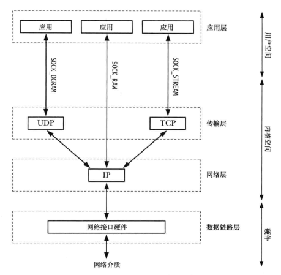

TCP/IP 分层联网协议，包括数据链路层，网络层，传输层，应用层（底层到高层）  
  

### 数据传递
高层传递信息给底层，底层不会解析高层数据，它会将信息放在底层的包中并加上自己的信息头，继续往下层传递；相反，底层传递给高层会对数据进行一层层解析（逆向解包）

### 数据链路层
- 从网络层传递过来的数据报封装到一个个帧，每个帧除了传递的数据之外，帧头还包含目标地址和帧大小；数据链路层传输帧，这一层会进行错误检测，重传以及流量控制；
多个帧会在接收端进行重组；
- 最大传输单元MTU，是传输的帧大小的上限

### 网络层
- 网络层主要协议是IP，IP以数据报的形式传输数据，一个数据报包含目标地址，源地址，从而可以路由到目标地址
- IP是无连接和不可靠的协议，可靠性由传输层协议TCP或应用程序保证
- 当IP数据报大于MTU时，会进行分段，以便封装到帧中（因为IP是不可靠协议，这可能导致数据丢失，因此应当避免对IP数据报分段，这样情况就是要在传输层处理了，只要
传输层传给网络层时数据报不会大于MTU就可以了，所以说可靠性需要由传输层来保证）

### 传输层
- 包括用户数据报协议UDP，传输控制协议TCP

#### TCP协议
- 建立连接；在开始通信前，两个端点建立一个通信信道
- 数据分段；每一个端包括检验和，从而能够检测出端到端传输错误，每一个段使用单个IP数据报来传输
- 确认，重传以及超时
- 排序（序号计数）；数据段第一个字节的序号，接收者对这些分段进行确认并以正确的顺序组装这些分段
- 流量控制；防止一个快速的发送者压垮一个慢速接收者；大概就是接收端的缓冲区满了，发送TCP就会停止传输数据
- 拥塞控制；防止一个快速的发送者压垮整个网络

### tcp建立3次握手

### 参考
- Linux系统编程手册(下册)
