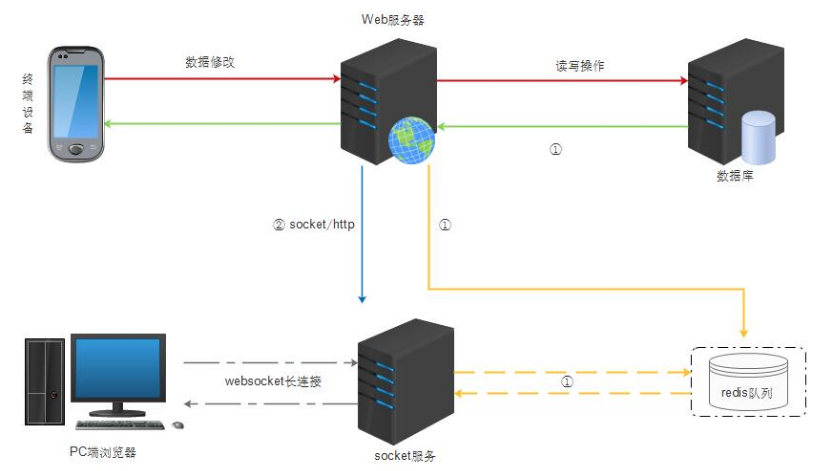

### 应用场景
> 以下场景都是我在项目实际应用到的

#### 使用队列
- 说明:关于队列可以参考我一篇文章, [Redis 实现队列](https://segmentfault.com/a/1190000011084493)
- 优化:这里主要讲下后台多个worker消费问题.采用swoole多进程管理多个worker消费者,worker消费者可以分为两类,一种是静态worker,即退出后会重启,一种是动态worker,只有当队列积压很多任务数,会启用动态新增worker缓解压力,处理完任务后退出不重启;每个worker可以设置worker最大执行时间,最大执行任务数,这样的好处是防止worker内存溢出;当然不要开太多进程,进程切换开销很大的;
- 参考[zcswoole消息队列](https://www.kancloud.cn/wuzhc/zcswoole/742975)

#### 保存统计数据或热点数据,不要求及时性的数据
- 说明:一般redis作为缓存工具使用,例如统计类数据,热点数据放在redis,因为redis是内存数据库,读取速度很可观,能够有效减轻mysql压力;
- 注意:需要注意的是缓存穿透和雪崩问题
    - 缓存穿透即绕过redis直接读取mysql,例如热点数据为空,不保存redis,导致每次请求读取不到redis时都去查询MySQL,建议是空数据时也要写一个空值到redis中,并且设置一个小的过期时间(如几分钟等等);
    - 缓存雪崩是redis突然失效,导致所有请求都去到了mysql,这种情况简单方法是用互斥锁,网上还有各种方法自行搜索
##### 缓存穿透
```php
if (!($cacheData = $redis->get('key'))) {
    $data = $mysql->getData();
    if (empty($data)) {
        $redis->set('key', json_encode($data), 60);   // 当数据为空时,设置一个小的过期时间,这样的好处是可以减低数据更新延时率
    } else {
        $redis->set('key', json_encode($data), 7200); // 正常的过期时间为两个小时
    }
}
```
##### 缓存雪崩 (参考:http://huoding.com/2015/09/14/463)
```php
$key = 'cache_create_lock';                                   // 锁的名称
$value = sha1(uniqid(getmypid().'_'.mt_rand().'_', true));    // 唯一值,加入唯一值判断是为了避免删除到其他操作的锁(这种情况是发生在生成cache过程很久导致锁到了过期时间,此时锁被另一个用户拿到,而当代码继续执行时,会把另一个用户拿到的锁误删掉)
$ttl = 10;                                                    // ttl表示超时时间time to live,单位是秒.
if ($redis->set($key, $value, array('nx', 'ex' => $ttl))) {   // 锁: nx表示not exists. ex表示expire.
    $cache->create();                                         // 加锁后执行业务逻辑,这里是生成缓存,注意锁的过期时间必须比create长,否则会出现死锁
    if ($redis->get($key) === $value) {                       // 认证锁,防止误删
        $redis->del($key);
    }
} else {
    // 拿不到锁,是sleep几秒后重新查询缓存,还是直接返回系统繁忙状态?
    // 缓存失效,又拿不到锁生成缓存,怎么办?直接返回请求失败?
}
 
```
#### 扫码登录
> 在扫码登录中,redis主要用于设置二维码过期时间,并在不同阶段保存扫码的不同状态  

扫码登录流程大概如下:
1. 生成二维码,二维码内容保存一个code,已code作为键,初始内容为{status:0,uid:0,portrait:''}
2. 手机扫描二维码,获得code;手机带上code和用户token请求服务端,服务端根据token查询用户信息,并保存到以code为键的缓存,状态设置为已扫描;{status:1,uid:1,portrait:'http://xxx.png'}
3. 游览器检测登录状态,每隔一秒轮询一次服务端,或者用websocket;如果此时已扫描,则轮询的接口会返回用户的头像到游览器的页面上
4. 手机确认登录,带上code和用户token请求服务端,服务端设置code状态为确认登录;{status:2,uid:1,portrait:'http://xxx.png'}
5. 客户端轮询到为确认状态,设置code状态为已登录,并自动执行登录;{status:3,uid:1,portrait:'http://xxx.png'}
6. 登录成功,清除缓存

status状态:
0 : 初始化
1 : 已扫描
2 : 确认登录
3 : 已登录

至于为什么登录时要设置一个已登录状态,是因为若游览器一秒请求一次服务端,此时服务端上一个请求登录过程超过1秒,还没登录完成时又来一个请求,设置为已登录的话,下一个请求只要看到为已登录状态则不处理直接忽略即可

#### 订阅发布功能(publish/subscribe)
订阅发布主要用于广播系统,例如聊天系统中的群聊,消息推送,同步操作等等;这里以同步操作为例子作为讲解
  
图片来源于https://www.cnblogs.com/JasonLeemz/p/5116814.html  
##### 大概流程如下:
- pc端游览器与websocket建立长连接
- websocket订阅redis (subscribe channel),一旦channel有数据,websocket主动推送数据给pc端游览器
- 手机设备修改数据,并执行发布 (publish channel message)
- websocket获取到channel的message,主动推送给pc游览器
##### 注意点:
- redis的订阅发布使用php内置的socket,默认超时时间为60秒,需要设置ini_set('default_socket_timeout', -1);
- php的redis扩展为阻塞IO,当websocket订阅redis,整个进程会阻塞,导致服务端的websocket不能处理其他事件,从而无法记录长连接fd,解决方法用异步redis
##### 下面是一个简单的基于swoole异步redis实现的websocket服务端
```php
class WebsocketServer
{
    public $fdMaps = [];

    /** @var \Swoole\WebSocket\Server */
    public $ws;

    public function __construct()
    {
        $this->ws = new Swoole\WebSocket\Server('0.0.0.0', 9503);
        $this->ws->on('open', [$this, 'open']);
        $this->ws->on('close', [$this, 'close']);
        $this->ws->on('workerStart', [$this, 'workerStart']);
        $this->ws->on('message', [$this, 'message']);
        $this->ws->set([
            'worker_num' => 1,
            'daemonize'  => 0,
        ]);
        $this->ws->start();
    }

    public function message($server, $frame)
    {
        $server->push($frame->fd, "hello");
    }

    public function workerStart(\Swoole\WebSocket\Server $server, $workerID)
    {
        $client = new \Swoole\Redis();
        $client->on('message', function ($client, $result) use ($server) {
            if ($result[0] == 'message') {
                foreach ($server->connections as $fd) {
                    $server->push($fd, $result[2]);
                }
            }
        });
        $client->connect('127.0.0.1', 6379, function ($client, $result) {
            $client->subscribe('channel');
        });
    }

    public function open($server, $request)
    {
        echo "fd $request->fd connect \n";
        $this->fdMaps[$request->fd] = $request->fd;
    }

    public function close($server, $fd)
    {
        if (isset($this->fdMaps[$fd])) {
            unset($this->fdMaps[$fd]);
            echo "fd $fd close \n";
        } else {
            echo "error\n";
        }
    }
}

new WebsocketServer();
```
html代码:
```html
<html>
<body>
<h1>Redis publish/subscribe</h1>
<div id="show-list"></div>
</body>
</html>
<script type="text/javascript" src="/chat/js/jquery.min.js"></script>
<script>
    $(function () {
        var ws = new WebSocket('ws://127.0.0.1:9503');
        ws.onopen = function () {
            console.log('connect success');
        };

        // 接受消息
        ws.onmessage = function (evt) {
            console.log(evt.data);
            var html = '<h3>' + evt.data + '</h3>';
            $('#show-list').append(html);
        };

        ws.onclose = function () {
            console.log('connect close');
        };
    });
</script>
```
调试:  
```bash
127.0.0.1:6379> publish channel hello
(integer) 1
# 响应的pc游览器会显示hello
```

#### 登录错误次数限制(发送手机号码次数限制)
> 主要使用了redis的setnx特性,以下是一个小时内,6次登录失败限制10分钟后再登录
```php
if ($hasErrors) { // 登录错误时,记录错误次数
    $res = $redis->set($key, 1, array('nx', 'ex' => 3600));
    if (false === $res && $redis->incr($key) > 5) {
        $redis->expire($key, 600);
        $this->addError('password', '登录失败次数有点频繁,请稍后再登录!');
    }
}
```
第一登录失败设置key,返回true,第二次失败返回false则错误次数加1;当错误次数达到5次,提示稍后登录

#### 抢购超卖问题:
> 思路:讲产品总数初始化到redis列表中,抢购一个则从列表一个,直到列表数据为空;这里是因为redis是单进程单线程,并发访问会变成串行访问,所以不会出现超买的问题
```php
/**
 * 抢购初始化
 */
function buyingInit()
{
    global $redis;
    $redis->multi(Redis::PIPELINE);
    for ($i = 1; $i <= 100; $i++) {
        $redis->rPush('goods:total', $i);
    }
    $redis->exec();
}

/**
 * 抢购
 */
function buying()
{
    global $redis;
    $uid = rand(1, 200);
    $key = 'success:buy';

    if ($redis->lPop('goods:total')) {
        // 用集合保存用户ID，可以保证值是唯一的
        if (empty($redis->sAdd($key, $uid))) {
            // 如果sadd失败，则重新加入到goods:total队列
            $redis->rPush('goods:total', $uid);
        }
    } else {
        echo "empty \n";
    }
}
```
压力测试和结果: 
